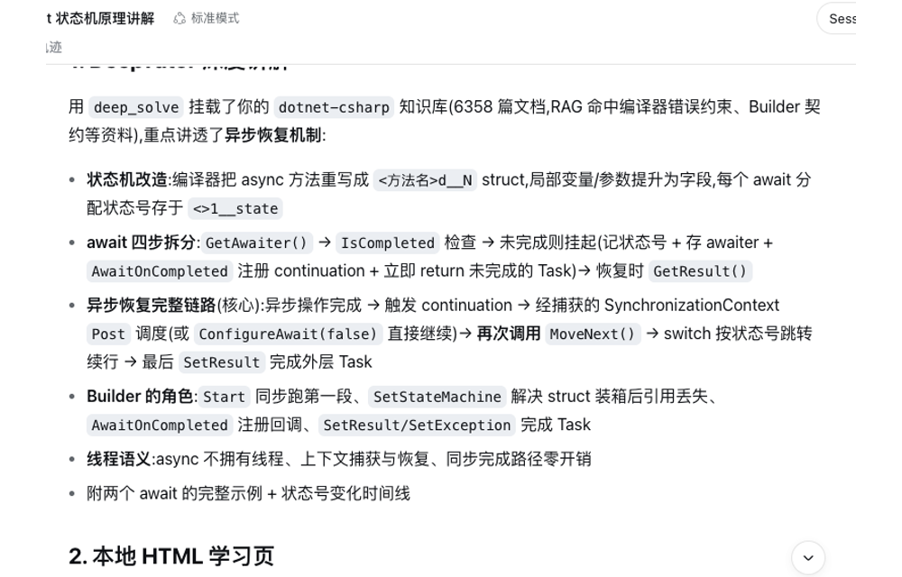
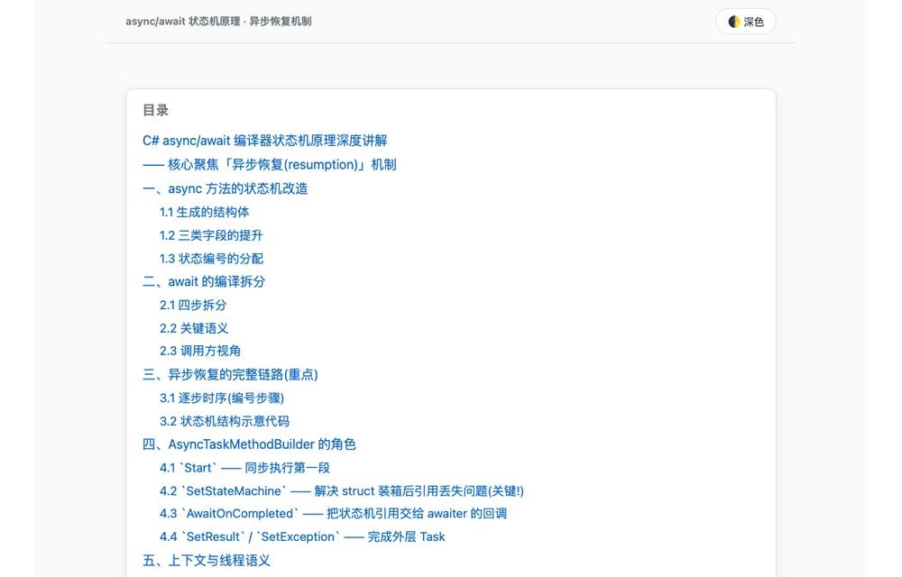

# dsh-deeptutor

[English](https://github.com/TecFancy/dsh-deeptutor/blob/main/README.md) | **简体中文**

面向 **DeepSeek Harness (dsh)** 的**学习辅助扩展**。它将 [HKUDS/DeepTutor](https://github.com/HKUDS/DeepTutor) 辅导服务接入你的 agent,让 dsh 会话能够深度讲解知识点、出题自测、规划学习路径、检索你的个人知识库,并把学习笔记归档到 notebook —— 全程不出 harness。

只要对 agent 说 *"给我讲讲 async/await"*,它就能跑一次 deep-solve,把答案渲染成可在浏览器打开的自包含 HTML 学习页,再把摘要归档进你的笔记本。

本扩展由 pi 编码 agent 扩展迁移而来(`TecFancy/pi-extensions`,`extensions/deeptutor` + `skills/deeptutor`)。

## 它带来什么

三个 agent 可见工具,当你请求学习帮助时由模型调用:

| 工具 | 作用 |
|---|---|
| `deeptutor_run` | 执行一次学习调用: `deep_solve`(深度讲解)/ `deep_question`(自测题)/ `deep_research` / `chat` / `mastery_path`(学习路径规划)/ `visualize` / `math_animator`(可视化)。可挂载你的知识库(`kbs`)与工具(`rag`、`web_search`、`reason`、`code_execution` 等);返回 `session_id`,后续轮次可延续同一上下文。 |
| `deeptutor_kb` | 列出 / 搜索 / 查看你的个人知识库(RAG) |
| `deeptutor_note` | 把 Markdown 学习笔记(计划、总结、错题等)归档到服务器 notebook |

上表 7 个 capability 是 `deeptutor_run` 工具接受的固定枚举。底层 DeepTutor CLI 可能支持更多命令 —— 用 `deeptutor --help` / `deeptutor <cmd> --help` 可枚举完整命令集。`deeptutor` skill 会指示 agent 以这种方式动态发现命令;当工具的枚举未覆盖某能力时,agent 可直接调用 CLI(本地二进制或经 SSH)来驱动。

## 示例会话

一次典型的"求学习帮助"流程:

1. **提问** —— *"用我的 dotnet 知识库讲讲 C# 泛型协变,并生成学习页。"*
2. agent 先检索你的自有资料:`deeptutor_kb`(`action=search`,`kb=dotnet`)。
3. 再执行深度讲解:`deeptutor_run`(`capability=deep_solve`,`kbs=[dotnet]`,`html=data/study/csharp-covariance.html`)—— 答案返回的同时,自包含 HTML 学习页(及配套 `.md` 源文件)写入磁盘。
4. 最后归档摘要:`deeptutor_note`(`notebook=dotnet-learning`,`type=solve`)。

以上不是固定脚本 —— agent 会根据你的提问自由选择工具与参数。

以下是该流程的真实录制(async/await 状态机 deep-solve,挂载 `dotnet-csharp` 知识库,渲染 HTML 学习页,归档笔记本):





## 环境要求

- 可用的 DeepSeek Harness (dsh) 安装。`dsh plugin add` 自动登记 bundle 已在 dsh CLI 0.1.0-rc.6 + pnpm 8.15.6 上验证。
- 一个 DeepTutor 部署,二选一:
  - **本地** —— 本机运行 `deeptutor serve`,或 PATH 上有 `deeptutor` CLI(作为回退);
  - **远程** —— DeepTutor 在服务器上,通过自动建立的 SSH 隧道访问(含 SSH CLI 回退)。

## 安装到 profile(bundle 方式)

包已发布到 npm(`dsh-deeptutor`)。推荐一条命令 —— 运行随包发布的安装器(`scripts/install-profile.mjs`,以 `dsh-deeptutor` 二进制暴露),它包装 `dsh plugin add` 并自动处理下文所述的 pnpm workspace-root 检查:

```sh
pnpm dlx dsh-deeptutor --profile web
```

从本仓库检出目录运行同一个安装器:

```sh
node scripts/install-profile.mjs --profile web
```

或者自己执行底层命令:`dsh plugin add` 会转发给 pnpm 安装依赖,并把 profile 的 `dsh.profile.bundles` 与已安装状态对账,因此声明了 `dsh.bundle` 的包(如本插件)会被自动登记:

```sh
dsh plugin --profile web add dsh-deeptutor -w
```

> **坑:pnpm workspace-root 检查。** dsh 的 profile 脚手架**总是**写入 `pnpm-workspace.yaml`(`packages: ["."]`、`nodeLinker: hoisted`),profile 目录本身就是 pnpm workspace 根。在 pnpm ≥ 8 上,`pnpm add` 在 workspace 根目录执行会因 `ERR_PNPM_ADDING_TO_ROOT` 中止,必须显式加 workspace-root 标志,所以上面的命令追加了 `-w`/`--workspace-root`(注意:Windows 上 pnpm 把这条错误打在 **stdout**,看起来像警告,实际是失败)。两种处理方式:
>
> 1. 使用安装器 / 命令保留 `-w`(推荐 —— 安装器先试裸命令,只有检查触发时才自动补 `-w`)。
> 2. 或者永久放行裸命令:在 `~/.dsh/profiles/<name>/pnpm-workspace.yaml` 中加入 `ignore-workspace-root-check: true`,之后 `dsh plugin --profile web add dsh-deeptutor` 按原样即可。

验证挂载,然后重启 dsh(bundle 列表在启动时解析):

```sh
dsh --profile web --dump-config | grep dsh-deeptutor
```

如果你的 dsh CLI 不会自动登记 bundle(旧版本,或手动安装依赖),请在 profile 清单(`~/.dsh/profiles/<name>/package.json`)中手动加入,再运行 `dsh plugin --profile web install`:

```json
{
  "dependencies": { "dsh-deeptutor": "^0.1.0" },
  "dsh": {
    "profile": { "bundles": ["@deepseek-ai/dsh-base", "@deepseek-ai/dsh-web-app", "dsh-deeptutor"] }
  }
}
```

也可以不动清单,改用用户 patch 层挂载 bundle(仍需先安装 npm 包):

```yaml
# overlay.yml —— 通过用户 patch 层插入 bundle 行
- insert:
    - id: dsh-deeptutor
      name: 'dsh-deeptutor'
```

```sh
dsh web --patch ./overlay.yml
```

bundle 清单(`dsh.bundle.patch → cordis.patch.yml`)负责插入插件行;上层 patch 层可按 id 覆盖或禁用。

## Skills

本包携带两个 skill(`skills/deeptutor` 与 `skills/html-doc`),随包安装器每次运行时都会把它们复制到 `<DSH_HOME>/skills/<name>/`(dsh 自动发现)—— 所以 `pnpm dlx dsh-deeptutor` 一次装齐插件 **和** skill:

- `deeptutor` — 面向 agent 的学习工作流(`~/.dsh/skills/deeptutor/SKILL.md`)
- `html-doc` — 将学习内容渲染为自包含 HTML 页面(`~/.dsh/skills/html-doc/`);`deeptutor_run` 传入 `html` 路径时,插件内部使用同一转换器(`scripts/md-to-html.js`)

升级包版本时会就地覆盖 skill 文件;包未携带的文件不会被删除。

`skills/` 下的文件与 `TecFancy/pi-extensions` 中的同名技能逐字节一致(以 pi 仓库为唯一来源,保持 agent 中立)。上游修改后执行 `node scripts/sync-skills.mjs ../pi-extensions` 同步。

## 配置(环境变量,与 agent 无关)

```bash
# 远程部署(DeepTutor 在服务器上,通过 SSH 隧道访问)
export DEEPTUTOR_SSH_HOST="tencent-cloud"           # SSH 主机别名(设置 = 远程模式)
export DEEPTUTOR_API_BASE="http://127.0.0.1:8001"   # 本地隧道地址
export DEEPTUTOR_REMOTE_BIN="/home/ubuntu/my-deeptutor/.venv/bin/deeptutor"
export DEEPTUTOR_REMOTE_HOME="/home/ubuntu/my-deeptutor"

# 本地部署 —— 不要设置 DEEPTUTOR_SSH_HOST
# export DEEPTUTOR_API_BASE="http://127.0.0.1:8001"  # 本地 serve 端口
# export DEEPTUTOR_LOCAL_BIN="deeptutor"             # 本地 CLI 路径(默认: PATH 上的 deeptutor)
```

修改环境变量后需重启 dsh。

## 工作原理

插件自动适配部署模式:若 DeepTutor API 可达(本地 `serve`,或经隧道的远程服务器),学习回合走 HTTP/WebSocket;否则回退到 CLI —— 本地的 `deeptutor` 二进制,或经 SSH 的远程二进制。远程模式按需启动 SSH 隧道,插件卸载时自动拆除。

## 源码开发(无需发布)

```sh
dsh web --patch /path/to/dsh-deeptutor/cordis.yml
```

## 构建与发布

```sh
npm install
npm run build        # tsc → lib/(相对 .ts import 改写为 .js)
npm run typecheck
npm test             # node:test + type stripping
npm pack             # 检查 dsh-deeptutor-<version>.tgz
npm publish
```

通过 `--patch` 直接加载 `src/*.ts` 需要 Node ≥ 22.6(type stripping);发布的 bundle 自带编译后的 `lib/`,安装到 profile 后仅需普通 Node ≥ 20 ESM。

## 目录结构

```
src/                 # TypeScript 源码(开发加载、类型检查)
lib/                 # 编译产物(发布入口,由 npm run build 生成)
scripts/md-to-html.js  # 零依赖 Markdown → HTML 转换器
scripts/install-profile.mjs  # 一键 profile 安装器(以 `dsh-deeptutor` 二进制暴露)
skills/              # 随包 skill:deeptutor/ + html-doc/(安装到 <DSH_HOME>/skills/)
cordis.yml           # 开发 overlay:按绝对路径插入 src/index.ts
cordis.patch.yml     # bundle patch:按包名插入插件
```

`src/index.ts` 注册工具;`config.ts` 环境配置;`cli-exec.ts` 本地/SSH CLI 执行;`http-api.ts` API 探测 + SSH 隧道;`turn.ts` 单次学习回合(WebSocket / CLI 事件折叠与格式化);`html-render.ts` 答案 → 自包含 HTML。
